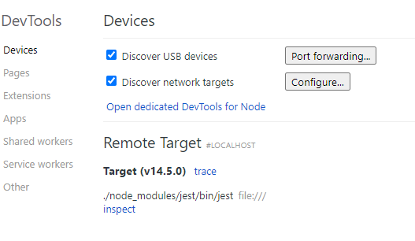
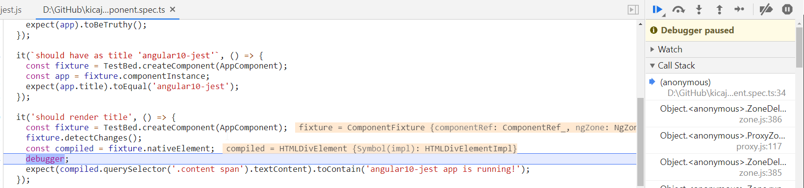
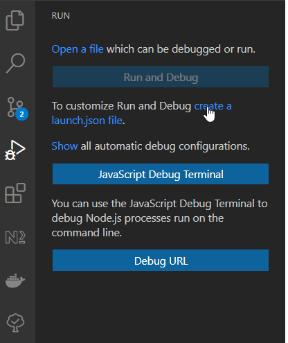
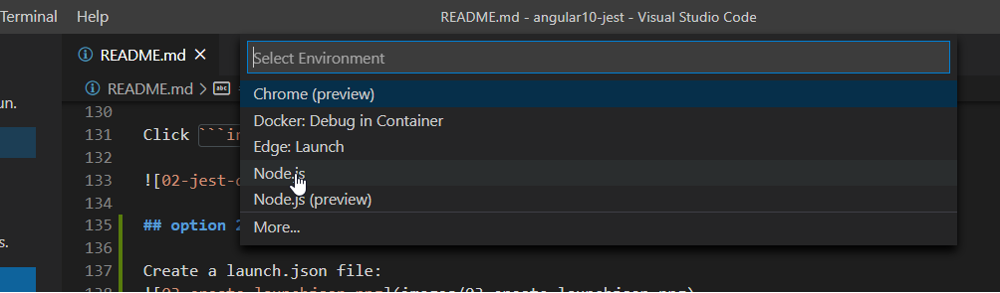

# steps to integrate jest with angular 10 project

## 1 install dependencies

```
npm install jest jest-preset-angular @types/jest --save-dev
```

## 2 add jest.config.js

## 3 update src/test.ts

## 4 update the content of the tsconfig.spec.json file

In compilerOptions section add:

```
 "types": [
      "jest", // 1
      "node"
    ],
    "esModuleInterop": true, // 2
    "emitDecoratorMetadata": true // 3
```

## 5 remove first line in tsconfig.json

I had to remove first line from tsconfig.json.

```
/* To learn more about this file see: https://angular.io/config/tsconfig. */
```

Although it was only comment it was the reason of the following error:

```
PS D:\GitHub\kicaj29\angular10-jest> npm run test

> angular10-jest@0.0.0 test D:\GitHub\kicaj29\angular10-jest
> jest

SyntaxError: D:\GitHub\kicaj29\angular10-jest\tsconfig.json: Unexpected token / in JSON at position 0
    at parse (<anonymous>)
    at Object.Module._extensions..json (internal/modules/cjs/loader.js:1235:22)
    at Module.load (internal/modules/cjs/loader.js:1050:32)
    at Function.Module._load (internal/modules/cjs/loader.js:938:14)
    at Module.require (internal/modules/cjs/loader.js:1090:19)
    at require (internal/modules/cjs/helpers.js:75:18)
    at Object.<anonymous> (D:\GitHub\kicaj29\angular10-jest\jest.config.js:2:29)
    at Module._compile (internal/modules/cjs/loader.js:1201:30)
    at Object.Module._extensions..js (internal/modules/cjs/loader.js:1221:10)
    at Module.load (internal/modules/cjs/loader.js:1050:32)
```
## 6 add reporter jest-junit

## 7 uninstall karma dependencies

```
npm uninstall karma karma-chrome-launcher karma-coverage-istanbul-reporter karma-jasmine karma-jasmine-html-reporter
```

## 8 rename karma.conf.js

Rename this file because we will not be using karma any more. We keep this file only to be able review its configuration in the future.

## 9 remove the test target inside the angular.json file

Because script ```test``` will run command ```jest``` we do not need the following target in ```angular.json```.

```json
"test": {
  "builder": "@angular-devkit/build-angular:karma",
  "options": {
    "main": "src/test.ts",
    "polyfills": "src/polyfills.ts",
    "tsConfig": "tsconfig.spec.json",
    "karmaConfig": "karma.conf.js",
    "assets": [
      "src/favicon.ico",
      "src/assets"
    ],
    "styles": [
      "src/styles.scss"
    ],
    "scripts": []
  }
},
```

# important parameters

* --runInBand
  Use it to avoid parallelization - makes sense for example when build server has limited CPU resources (for example only one core)
  https://stackoverflow.com/questions/43864793/why-does-jest-runinband-speed-up-tests   
  https://jestjs.io/docs/en/23.x/cli#--runinband   
  https://github.com/facebook/jest/issues/1524#issuecomment-262366820
* --silent=true   
  https://jestjs.io/docs/en/23.x/cli#--silent

# schematics

jest can be also added automatically using schematics for example: https://github.com/briebug/jest-schematic

```
ng add @briebug/jest-schematic
```

# debugging jest

## option 1 - debugging in default browser

Add to ```package.json``` script ```"test:debug:watch": "node --inspect-brk --inspect ./node_modules/jest/bin/jest -i --watch"```.

Run script ```npm run test:debug:watch```:

```
PS D:\GitHub\kicaj29\angular10-jest> npm run test:debug:watch

> angular10-jest@0.0.0 test:debug:watch D:\GitHub\kicaj29\angular10-jest
> node --inspect-brk --inspect ./node_modules/jest/bin/jest -i --watch

Debugger listening on ws://127.0.0.1:9229/1c47fdba-e5aa-4439-8e11-d4ae243c3265
For help, see: https://nodejs.org/en/docs/inspector
```

Next run Chrome with url: ```chrome://inspect``` and go to devices section.
Wait few seconds and in remote target section will appear jest URL:



Click ```inspect``` link. New tab will be opened were you will be able debug unit tests.



## option 2 - debugging in VSC

### launch.json
Create a launch.json file:


Select node environment:


It will create file ```launch.json``` in ```.vscode``` folder.

Next update this file with the following content:

```json
{
    // Use IntelliSense to learn about possible attributes.
    // Hover to view descriptions of existing attributes.
    // For more information, visit: https://go.microsoft.com/fwlink/?linkid=830387
    "version": "0.2.0",
    "configurations": [
      {
        "type": "node",
        "request": "launch",
        "name": "Jest All",
        "program": "${workspaceFolder}/node_modules/@angular/cli/bin/ng",
        "cwd": "${workspaceFolder}",
        "args": [
          "test",
          "--testMatch=\"**/+(*.)+(spec|test).+(ts|js)?(x)\"",
          "--runInBand"
        ],
        "console": "integratedTerminal",
        "internalConsoleOptions": "neverOpen",
        "disableOptimisticBPs": true,
      },
      {
        "type": "node",
        "request": "launch",
        "name": "Jest Current File",
        "program": "${workspaceFolder}/node_modules/@angular/cli/bin/ng",
        "cwd": "${workspaceFolder}",
        "args": [
          "test",
          "--testMatch=\"**/+(*.)+(spec|test).+(ts|js)?(x)\"",
          "--testPathPattern=${fileBasenameNoExtension}",
          "--runInBand",
        ],
        "console": "integratedTerminal",
        "internalConsoleOptions": "neverOpen",
        "disableOptimisticBPs": true,
      }
    ]
}
```

### @angular-builders/jest
Install:

```
npm install --save-dev @angular-builders/jest
```

### update angular.json

```json
"test": {
  "builder": "@angular-builders/jest:run",
  "options": {
    // jestConfig, tsConfig, setupFile could be removed because anyway these are their default values!
    "jestConfig": "./jest.config.js",
    "tsConfig": "./tsconfig.spec.json",
    "passWithNoTests": false,
    "setupFile": "./src/test.ts"
  }
}
```

### add new scripts to package.json

```json
"test": "ng test --coverage",
"test:watch": "ng test --watch",
```

Press F5 to start debugging in VS Code


# resources
https://www.amadousall.com/how-to-set-up-angular-unit-testing-with-jest/   
https://mattmazzola.medium.com/how-to-debug-jest-tests-with-vscode-48f003c7cb41   
https://artsy.github.io/blog/2018/08/24/How-to-debug-jest-tests/   
https://code.visualstudio.com/docs/editor/debugging   
https://dev.to/angular/setup-jest-for-angular-with-debugging-in-visual-studio-code-2d96   
